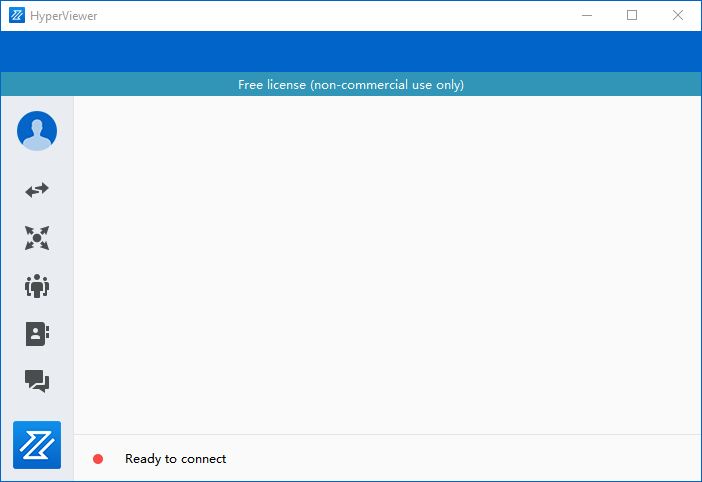
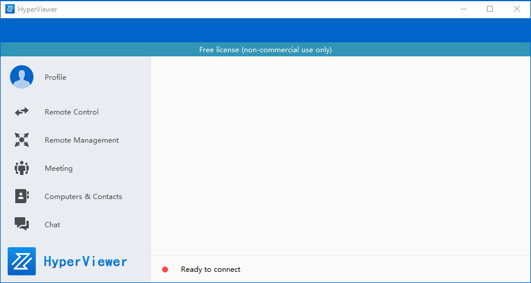

# HyperViewer

HyperViewer is a very simple remote control desktop tools.

- Clients are written using Qt tools and can support Windows and Linux.
- The server side is written in Golang and supports both Windows and Linux.
- If the network environment allows, the p2p protocol transmission is preferred.
- Currently in the research and development stage, bugs are being repaired one after another.

If you find a bug, please send it to the email address: zhangzhongyuan132@163.com

thank you for your support!
